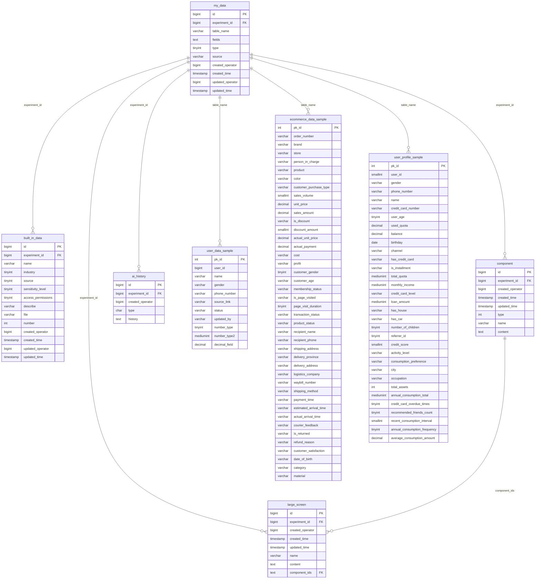

# COM_BI 数据库表关系图

## 📊 数据库实体关系图 (ERD)



## 🏗️ 数据库架构说明

### 📋 表结构分类

| 分类 | 表名 | 功能描述 |
|------|------|----------|
| **元数据管理** | `my_data` | 数据集注册中心，管理所有动态数据表 |
| | `built_in_data` | 内置数据集库 |
| **分析工具** | `component` | 可复用分析组件 |
| | `large_screen` | 数据大屏展示 |
| | `ai_history` | AI分析历史记录 |
| **业务数据** | `*_my_data` | 动态创建的业务数据表（20+张） |

### 🔗 核心关联关系

1. **实验维度关联**
   ```
   experiment_id → 串联所有业务表
   ```

2. **数据表动态关联**
   ```
   my_data.table_name → 指向具体的动态数据表
   命名规则: {user_id}_{experiment_id}_my_data
   ```

3. **组件组合关系**
   ```
   large_screen.component_ids → 关联多个 component.id
   ```

### 📊 数据类型分布

#### 🧑‍💼 用户数据类型 (7张表)
- 基础用户信息：姓名、性别、手机号
- 来源渠道和状态管理
- 数字字段和时间字段

#### 🛒 电商数据类型 (13张表)
- **订单信息**: 订单号、品牌、店铺、负责人
- **商品信息**: 商品名、颜色、品类、材质
- **销售数据**: 销量、单价、销售额、成本、利润
- **客户信息**: 性别、年龄、会员状态、购买类型
- **物流信息**: 发货地址、物流公司、运单号、送达时间
- **交易状态**: 支付时间、交易状态、退货信息、满意度

#### 💳 用户画像类型 (1张表)  
- **基础信息**: 姓名、性别、年龄、生日、城市、职业
- **金融信息**: 信用卡、额度、余额、贷款、信用评分
- **资产信息**: 房产、车辆、子女、总资产
- **行为信息**: 消费偏好、活跃度、消费频次、推荐好友

### 🎯 业务应用场景

1. **📈 数据分析实验平台**
   - 多用户、多实验并行支持
   - 数据集版本管理和血缘追踪

2. **🛍️ 电商业务分析**
   - 订单分析、客户行为分析
   - 商品销售分析、物流效率分析
   - 营销效果评估

3. **👤 用户画像建模**
   - 金融用户信用评估
   - 消费行为预测
   - 风险控制分析

4. **📊 数据可视化**
   - 组件化图表构建
   - 交互式大屏展示
   - AI辅助分析

### 🔧 技术特点

- ✅ **高度结构化**: 统一的字段设计和命名规范
- ✅ **业务完整性**: 覆盖电商全链路数据
- ✅ **实验友好**: 支持数据科学实验和A/B测试
- ✅ **可视化就绪**: 内置组件化可视化支持
- ✅ **AI集成**: 支持AI分析历史记录和追踪

---

> 💡 **使用提示**: 这个数据库设计特别适合构建商业智能(BI)平台，支持灵活的数据分析和可视化需求。通过experiment_id的设计，可以很好地支持多租户和实验管理。
