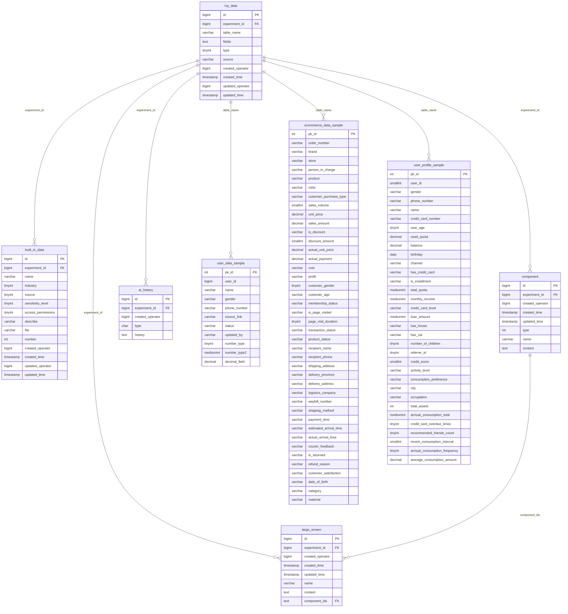

# COM_BI 数据库表关系图

## 数据库表结构关系图

## 表关系说明

### 🔗 **核心关联关系**

1. **实验维度关联**
   - 所有业务表都通过 `experiment_id` 与 `my_data` 表关联
   - 形成以实验为中心的数据组织架构

2. **数据表动态关联**
   - `my_data.table_name` 存储实际的动态数据表名
   - 动态数据表命名规则：`{user_id}_{experiment_id}_my_data`

3. **组件组合关系**
   - `large_screen.component_ids` 关联多个 `component.id`
   - 实现数据可视化大屏的组件化构建

### 📊 **数据分层架构**

#### **第一层：元数据管理**
- `my_data` - 数据集注册中心
- `built_in_data` - 内置数据集库

#### **第二层：分析工具**
- `component` - 可复用分析组件
- `large_screen` - 数据大屏展示
- `ai_history` - AI分析记录

#### **第三层：业务数据**
- **用户数据表族** - 基础用户信息
- **电商数据表族** - 完整电商交易链路数据
- **用户画像表族** - 金融用户画像数据

### 🎯 **业务场景**

这个数据库支持以下主要业务场景：

1. **数据分析实验平台**
   - 支持多用户、多实验并行
   - 数据集版本管理和血缘追踪

2. **电商业务分析**
   - 订单分析、客户分析、商品分析
   - 物流分析、营销效果分析

3. **用户画像建模**
   - 金融用户信用评估
   - 消费行为分析和预测

4. **数据可视化**
   - 组件化图表构建
   - 大屏数据展示

### 🔍 **数据质量特点**

- **高度结构化**: 统一的字段设计和命名规范
- **业务完整性**: 覆盖电商全链路数据
- **实验支持**: 支持数据科学实验和A/B测试
- **可视化友好**: 内置组件化可视化支持

